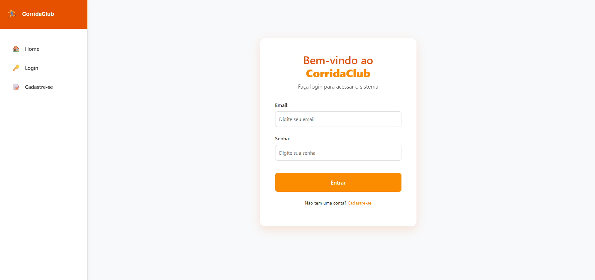
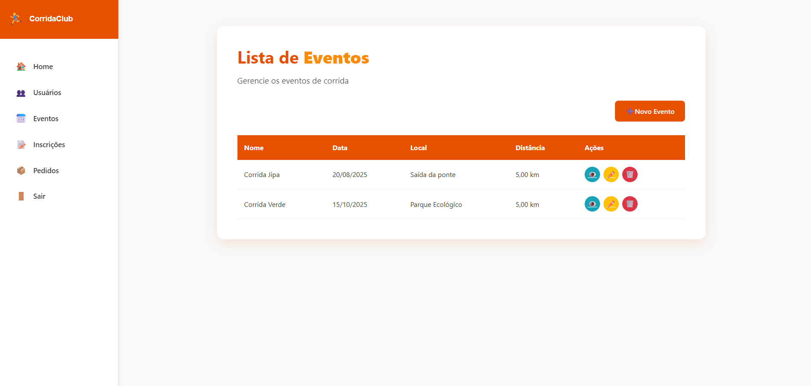

# 🏃‍♀️ CorridaClub

**CorridaClub** é um sistema web desenvolvido em ASP.NET Core com Entity Framework e MySQL, voltado para a gestão de eventos de corrida. O sistema permite o gerenciamento de provas, participantes, inscrições e resultados de forma prática e eficiente.

---

## 📋 Funcionalidades

- ✅ Cadastro de Usuários/Participantes  
- ✅ Cadastro de Eventos/Provas  
- ✅ Cadastro de Inscrições  
- ✅ Cadastro de Pedidos  
- ✅ Interface web com Razor Pages  
- ✅ Integração com banco de dados MySQL

---

## 🛠️ Tecnologias Utilizadas

- ASP.NET Core  
- Entity Framework Core  
- MySQL  
- Razor Pages  
- Bootstrap  
- C#  
- HTML / CSS

---

## 💾 Requisitos

- .NET 6 SDK ou superior  
- MySQL Server (8.0 ou superior)  
- Visual Studio 2022 (ou editor compatível)  
- Ferramenta para gerenciar banco de dados (ex: MySQL Workbench)

---

## ⚙️ Como Executar o Projeto

1. **Clone o repositório**:
   ```bash
   git clone https://github.com/LhuanyMotta/CorridaClub.git
   ```

2. **Abra o projeto no Visual Studio 2022**.

3. **Configure a string de conexão no arquivo `appsettings.json`**:
   ```json
   "ConnectionStrings": {
     "DefaultConnection": "server=localhost;database=CorridaClubDB;user=root;password=SuaSenha"
   }
   ```

4. **Aplique as migrations e atualize o banco de dados**:
   ```bash
   dotnet ef database update
   ```

5. **Execute o projeto**:
   ```bash
   dotnet run
   ```

6. **Acesse no navegador**:
   ```
   https://localhost:5001 (ou a porta configurada)
   ```

---

## 📁 Estrutura do Projeto

```
CorridaClub/
├── Connected Services/             # Serviços conectados
├── Dependências/                   # Pacotes NuGet e bibliotecas
├── Properties/                     # Configurações do projeto
├── wwwroot/                        # Arquivos estáticos
├── Components/                     # Componentes reutilizáveis
│   └── Pages/                      # Páginas (ex: Home.razor)
├── Contexto/                       # DbContext e configuração do banco
├── Controllers/                    # Controladores (caso API)
├── Database/                       # Migrations e scripts do banco
├── Models/                         # Entidades do sistema
├── Providers/                      # Serviços auxiliares
├── appsettings.json                # Configuração da aplicação
├── Program.cs                      # Inicialização do app
└── CorridaClub.csproj              # Arquivo do projeto .NET
```

---

## 📷 Imagens do Sistema

> 💡 *Demonstrativo do sistema CorridaClub:*





---

## 🙋‍♀️ Autoria

Desenvolvido por: **Lhuany Motta** [🔗 GitHub](https://github.com/LhuanyMotta)
                  **Lucas Guilherme** [🔗 GitHub](https://github.com/Lucas-S-Guilherme)

---

## 📜 Licença

Este projeto está licenciado sob a licença MIT.
